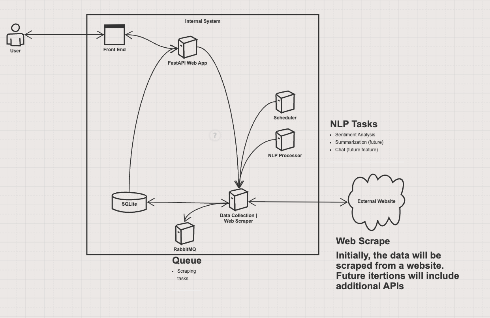

# News Scraper

A simple web application to scrape and display news articles.

### 1. High-Level Description of Application Developed for Project
#### Project Overview
The project is a News Aggregator application that collects and displays news articles from various sources. The application is designed to offer a user-friendly interface for viewing the latest news and provides features for searching and filtering articles based on keywords.

### 2. Whiteboard Architecture Diagram and Description
#### Architecture Diagram

#### Description of the Diagram
The architecture of the News Aggregator Application includes the following components:

1. FastAPI Web Server: Hosts the FastAPI application and serves the frontend.
    - Selected for its speed and ease of use.
    - Handles API requests from the frontend.
    - Provides endpoints for retrieving, searching, and filtering news articles.
    - Manages user interactions and delivers content dynamically.
2. SQLite Database: Stores news article metadata. 
    - Chosen as SQLite for simplicity and portability.
    - Stores article data such as title, URL, summary, source, published date, and creation date.
    - Allows efficient querying and retrieval of news articles.
3. RabbitMQ: Manages background tasks and communication between services.
    - Queues tasks for scraping news articles from external sources.
4. Frontend: Basic HTML/JavaScript to render the user interface.
5. External News Sources: Various online news websites that the application scrapes articles from.

Testability:
- Unit Tests:
    - Test functions and methods, such as retrieving articles, storing them in the database, and filtering based on keywords.

- Integration Tests:
    - Test the interaction between different components, such as the web server and the database

### 3. Hosted Application URL and github
- [News Aggregator Application](https://serene-stream-48049-c4c4b14d32ba.herokuapp.com/)
- [GitHub Repository](https://github.com/lmarte17/news-agg/)
